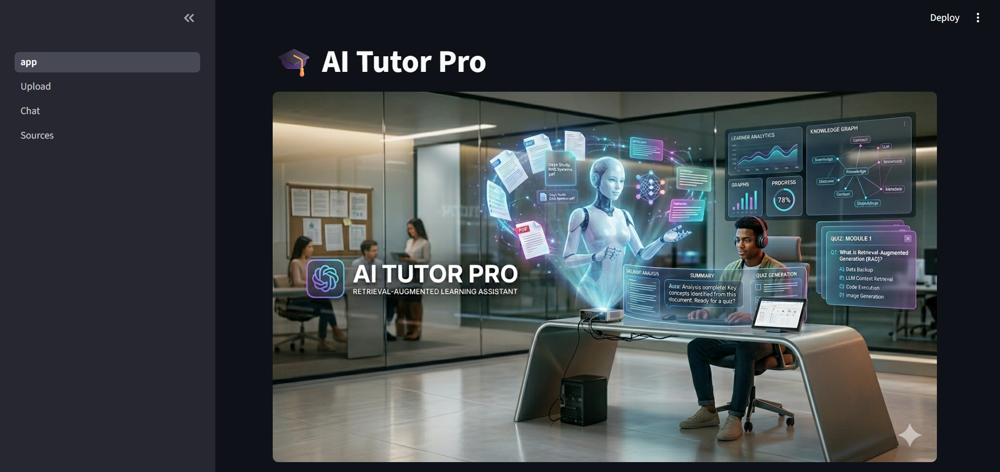
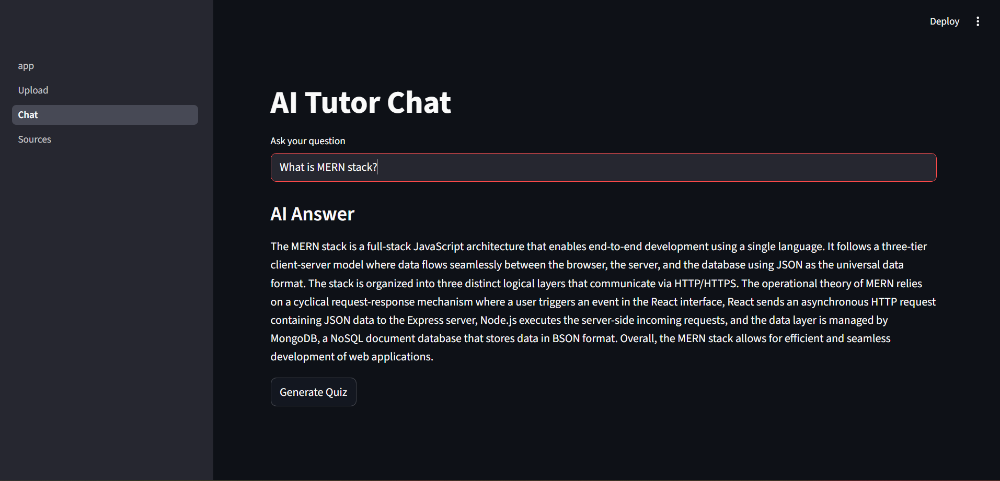
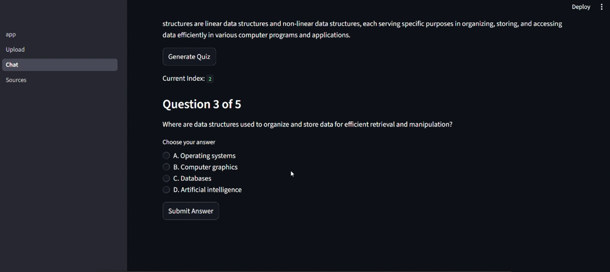
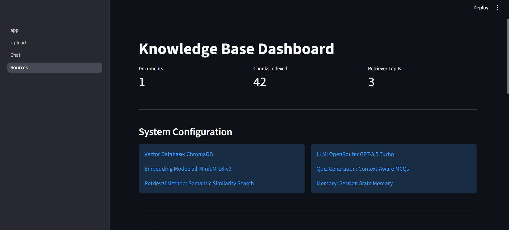

# 🎓 AI Tutor Pro – Retrieval-Augmented Learning Assistant

## 📌 Project Overview

AI Tutor Pro is an intelligent educational assistant built using Generative AI and Retrieval-Augmented Generation (RAG).

The application enables users to upload PDF documents, ask context-aware questions, generate quizzes automatically, and evaluate their understanding through AI-generated assessments.

Unlike traditional chatbots that may hallucinate information, this system retrieves relevant information directly from uploaded documents before generating responses, ensuring more accurate and reliable answers.

---

# 🚀 Key Features

### 📄 PDF Upload & Processing

* Upload educational documents in PDF format.
* Automatic text extraction.
* Document preprocessing and chunking.

### 🧠 Retrieval-Augmented Generation (RAG)

* Semantic search using vector embeddings.
* ChromaDB vector database integration.
* Retrieval of contextually relevant chunks.
* Reduced hallucinations.

### 💬 Intelligent Question Answering

* Ask questions related to uploaded documents.
* Context-aware responses.
* Memory-enabled conversation support.

### 💾 Memory Management(3 Memories)

* Streamlit Session-based memory.
* Maintains previous user interactions.
* Improves conversational continuity.

### 📝 AI Quiz Generator

* Generates 5 MCQs automatically from retrieved context.
* Structured JSON generation using LLM.
* Context-based assessment.

### ✅ Quiz Evaluation

* Answer validation.
* Score tracking.
* Detailed explanations.
* Quiz completion summary.

### ⚡ FastAPI Integration

* Backend API endpoints.
* Swagger documentation support.
* REST API architecture.

### 🌐 Interactive UI

* Built using Streamlit.
* Multi-page application.
* User-friendly dashboard.

---

# 🏗️ System Architecture

```text
User
 │
 ▼
Upload PDF
 │
 ▼
Text Extraction
 │
 ▼
Chunking
 │
 ▼
Embedding Generation
 │
 ▼
ChromaDB stores Vectors
 │
 ▼
Retriever
 │
 ▼
Relevant Context
 │
 ▼
Large Language Model
 │
 ▼
Answer Generation
 │
 ├──────────────► Chat Response
 │
 └──────────────► Quiz Generation
```

---

# 📸 Application Screenshots

## Home Page



```markdown

```

---

## Chat Interface



```markdown

```

---

## Quiz Generation



```markdown

```

---

## Sources Dashboard



```markdown

```

---

# 🧠 Retrieval-Augmented Generation Workflow

## Step 1: Document Upload

User uploads a PDF document containing educational content.

## Step 2: Text Extraction

The uploaded PDF is processed and raw text is extracted.

## Step 3: Chunking

Large documents are divided into smaller chunks to improve retrieval accuracy
chunk size is 500 character.

## Step 4: Embedding Generation

Text chunks are converted into vector embeddings using Sentence Transformers.

## Step 5: Storage in ChromaDB

Generated embeddings are stored inside ChromaDB vector database.

## Step 6: User Query

User asks a question related to the uploaded document.

## Step 7: Semantic Retrieval

Most relevant chunks are retrieved using vector similarity search.

## Step 8: Context Construction

Retrieved chunks are combined into a single context.

## Step 9: Answer Generation

The LLM generates a response using:

* Retrieved Context
* User Question
* Conversation Memory

---

# 📝 Quiz Generation Workflow

```text
Retrieved Context
        │
        ▼
LLM Structured Output
        │
        ▼
JSON Quiz Generation
        │
        ▼
5 MCQs Generated
        │
        ▼
User Answers Questions
        │
        ▼
Automatic Evaluation
        │
        ▼
Final Score
```

---

# 💾 Memory Architecture

The application maintains three types of session memory:

### Chat Memory

Stores:

* User Questions
* AI Responses

### Quiz Question Memory

Stores:

* Generated Quiz Questions

### Quiz State Memory

Stores:

* Current Question Index
* Score
* Answer Status

---

# ⚙️ FastAPI Endpoints

## Root Endpoint

```http
GET /
```

Response:

```json
{
  "message": "AI Tutor API Running"
}
```

---

## Chat Endpoint

```http
POST /chat
```

Request:

```json
{
  "question": "What is Machine Learning?"
}
```

Response:

```json
{
  "answer": "Machine Learning is a subset of Artificial Intelligence."
}
```

---

# 🛠️ Technology Stack

## Frontend

* Streamlit

## Backend

* FastAPI
* Python

## Vector Database

* ChromaDB

## Embedding Model

* Sentence Transformers
* all-MiniLM-L6-v2

## Large Language Model

* OpenRouter API(GPT-3.5 Turbo)

## Data Processing

* PyPDF
* JSON

---

# 📂 Project Structure

```text
project/
│
├── backend/
│   ├── chunking.py
│   ├── embeddings.py
│   ├── llm.py
│   ├── pdf_reader.py
│   ├── quiz_generator.py
│   ├── retrieval.py
│   ├── vectordb.py
│
├── pages/
│   ├── Upload.py
│   ├── Sources.py
│   ├── Sources.py
│
├── chroma_db/
│
├── api.py
│
├── app.py
│
├── requirements.txt
│
└── README.md
```

---

# 🔧 Installation

## Clone Repository

```bash
git clone <https://github.com/AyushRaut7099/Project-1-Education-EdTech---Generative-AI-Tutor-Adaptive-Learning-Platform>
```

## Create Virtual Environment

```bash
python -m venv .venv
```

## Activate Environment

Windows:

```bash
.venv\Scripts\activate
```

## Install Dependencies

```bash
pip install -r requirements.txt
```

---

# ▶️ Running the Application

## Start Streamlit

```bash
streamlit run app.py
```

## Start FastAPI

```bash
uvicorn api:app --reload
```

---

# 📈 Future Enhancements

* True Server-Sent Events (SSE)
* User Authentication
* Multi-PDF Support
* Persistent Memory
* Quiz Difficulty Levels
* Learning Analytics Dashboard
* Cloud Deployment

---

# 🎯 Learning Outcomes

This project demonstrates practical implementation of:

* Retrieval-Augmented Generation (RAG)
* Vector Databases
* Semantic Search
* Prompt Engineering
* Session Memory
* Structured JSON Generation
* FastAPI APIs
* Streamlit UI Development
* Generative AI Application Development

---

# 👨‍💻 Author

Ayush

Generative AI Internship Project

AI Tutor Pro – Retrieval-Augmented Learning Assistant
